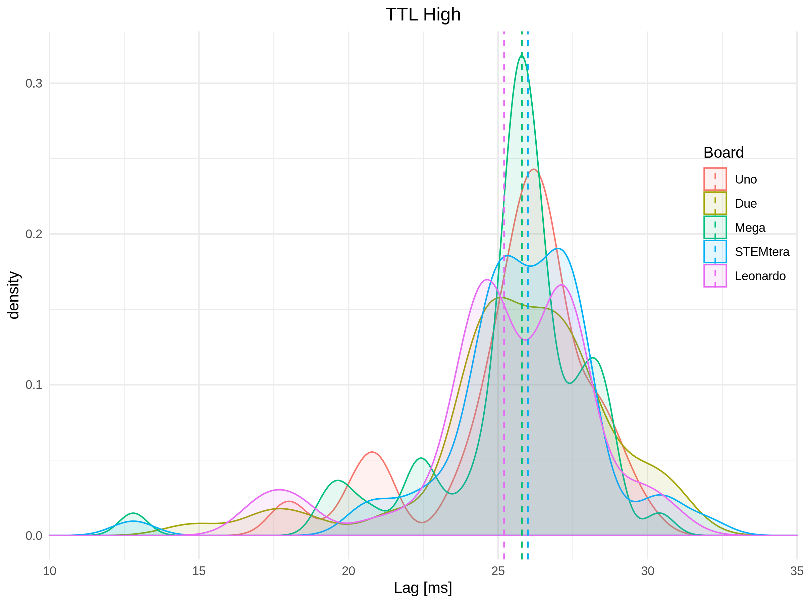

# Matlab TTL trigger

Data acquired with Tektronix TDS 1002B (directly saved to USB stick).

The Arduino was controlled via Matlab; the main intention behind these timing tests was to check if the added lag caused by the USB communication would differ for different boards. In addition, I tried to get a better estimate, how long this lag is, and how consistent.

## Matlab Arduoni TTL series generater

https://www.mathworks.com/matlabcentral/fileexchange/47522-matlab-support-package-for-arduino-hardware

``` Matlab
function Test_Arduino_TTL(chan, Period)
% create a continous pulse series

if(~exist('chan','var') || isempty(chan))
    chan = 12;
end

if(~exist('Period','var') || isempty(Period))
    Period = [100, 100];
elseif(length(Period) == 1)
    Period = [Period, Period];
end

if(any(Period > 5))
    Period = Period ./ 1000;  % need the time in seconds
end

a = arduino;

chanstr = sprintf('D%d', chan);
    
while(~KbCheck)
    % On phase
    writeDigitalPin(a, chanstr, 1);
    WaitSecs(Period(1));
    
    % Off phase
    writeDigitalPin(a, chanstr, 0);
    WaitSecs(Period(2));
end

clear a;
```


## tested boards

* [**Arduino Uno**](https://store.arduino.cc/usa/arduino-uno-rev3)
* [**Arduino Due**](https://store.arduino.cc/usa/arduino-due)
* [**Sunfounder Mega**](https://www.sunfounder.com/mega-2560-compatible-with-arduino.html)

Correctly recognized by Matlab as Arduino Mega board.

* [**STEMtera**](https://stemtera.com/)

Recognized by Matlab as Arduino Uno and works as expected.

* [**Arduino 101**](https://store.arduino.cc/usa/arduino-101)

Matlab does not recognize the Arduino 101 board and hence it was not possible to test the TTL timings for this board.
[**Keyestudio Leonardo**](http://www.keyestudio.com/ks0248.html)

Correctly recognized by Matlab.

[**Keyestudio CH340 chip Nano 3.0**](http://www.keyestudio.com/ks0173.html)

Matlab did not recognize this board and therefore it was not tested.


[**Teensy 3.6**](https://www.pjrc.com/store/teensy36.html)
Matlab did not recognize this board and therefore it was not tested.

## Summary




