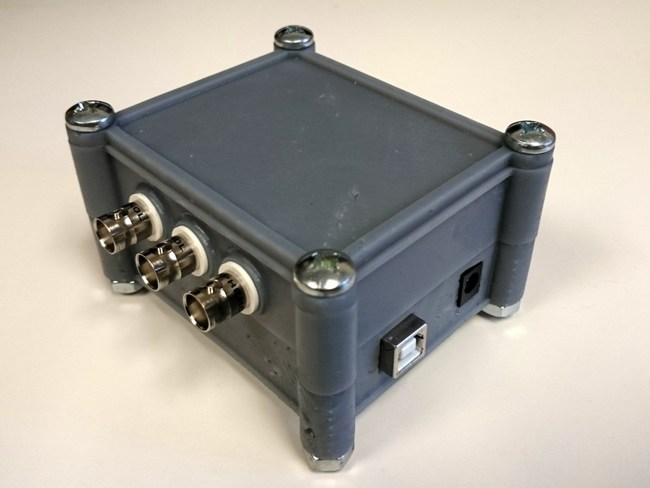
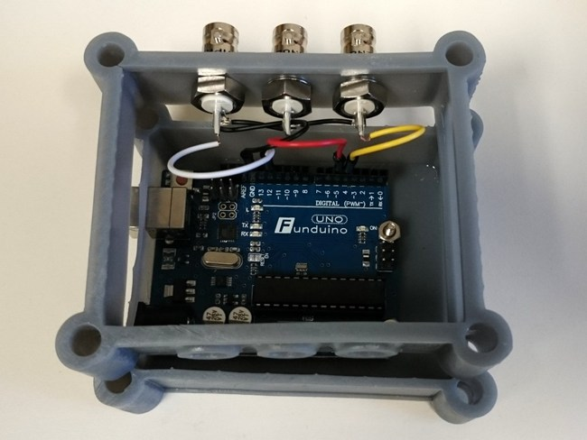

# Reward Controller

I built the Arduino enclosure and adapted the code for the rig set-up in the [Disney-Lab](https://github.com/neurodisney/arduino_sketches/tree/master/RewardControl/DisneyReward). There was the need to be able to control reward delivery by either a manual button press or a computer controled TTL pulse of defined duration.Accordingly, the problem was to translate a button press into a TTL pulse with a defiend duration, or just forward the computer generated TTL pulse.

The Arduino listens to two ports, one port will provide a single button press and the other port will provide a continuous change of a TTL signal (to high or low, parameter in script). This input will be forwarded as TTL pulse of defined duration to a solenoid controller in order to open it and provide reward. The button press will be translated to a deined duration (fixed parameter) whereas the continuous pulse from the computer will be forwarded as it is. 

I used a 3D printed enclosure (Fig. 1) for the Arduino board (uno clone) using this [template for a 3D printer](http://www.thingiverse.com/thing:379158 ). This arduino box is very versatile and could be used for several other applications in experimental set-ups. However, the reisin used for this prototype was not very sturdy an easily broke. 
 
 ||
 |----| 
|**Fig. 1:** Reward Controller Enclosure.|

The wiring diagram is very simple, it uses three connections, one for the manual button, the other for the computer TTL pulse, and the third for the output TTL pulse forwarded to the reward system (Fig. 2).

||
|----| 
|**Fig. 2:** Wiring inside the Reward Controller Enclosure.|
